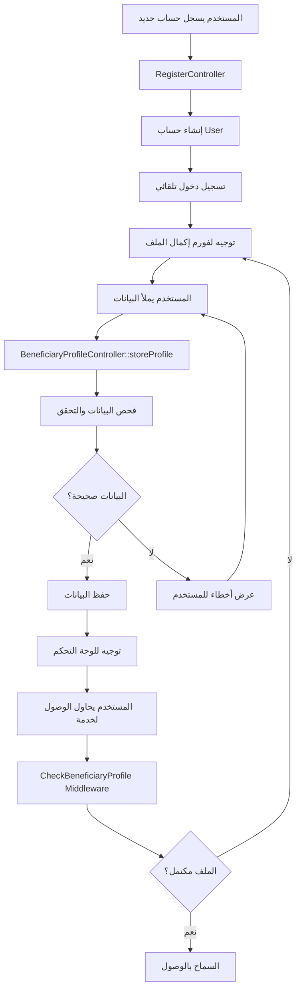

# نظام إكمال الملف الشخصي للمستفيد

## الوصف
تم تطوير نظام شامل لإكمال الملف الشخصي للمستفيد بعد عملية التسجيل مباشرة، يضمن جمع جميع المعلومات المطلوبة قبل السماح بالوصول لخدمات النظام.

## المميزات الجديدة

### 1. فورم إكمال الملف الشخصي
- **الصفحة**: `resources/views/beneficiary/profile-form.blade.php`
- **المسار**: `/beneficiary/profile/form`
- تصميم عصري وجذاب مع تدرج لوني أزرق
- فورم شامل يحتوي على:

#### المعلومات الأساسية المطلوبة:
- ✅ الاسم الكامل
- ✅ تاريخ الميلاد (مع فحص العمر: 16-100 سنة)
- ✅ رقم الهوية/الإقامة (فريد)
- ✅ الحالة الاجتماعية (أعزب/متزوج/مطلق/أرمل)
- ✅ عدد أفراد الأسرة (مع فحص منطقي حسب الحالة الاجتماعية)
- ✅ العنوان الكامل
- ✅ رقم الهاتف

#### المعلومات الاختيارية:
- الجنس (ذكر/أنثى)
- حالة التوظيف (عاطل/دوام جزئي/دوام كامل/متقاعد/طالب)
- مستوى الدخل الشهري (6 مستويات من لا يوجد دخل إلى أكثر من 3000 شيكل)
- المستوى التعليمي (من لا يوجد إلى دكتوراه)
- احتياجات خاصة أو ملاحظات

### 2. Controller متخصص
- **الملف**: `app/Http/Controllers/BeneficiaryProfileController.php`
- يحتوي على:
  - `showProfileForm()`: عرض فورم إكمال الملف
  - `storeProfile()`: حفظ بيانات الملف الشخصي
  - `checkProfileCompleteness()`: فحص اكتمال الملف (API)
  - `showProfile()`: عرض الملف للمراجعة
  - `editProfile()` و `updateProfile()`: تعديل الملف

### 3. Middleware للتحقق من اكتمال الملف
- **الملف**: `app/Http\Middleware\CheckBeneficiaryProfile.php`
- **الاسم**: `check.beneficiary.profile`
- يفحص اكتمال الملف الشخصي قبل السماح بالوصول لخدمات المستفيد
- يوجه تلقائياً للفورم إذا لم يكن مكتملاً

### 4. تحديث عملية التسجيل
- **الملف**: `app/Http/Controllers/Auth/RegisterController.php`
- تم تعديل الـ redirect بعد التسجيل من لوحة التحكم إلى فورم إكمال الملف
- رسالة ترحيب مناسبة: "تم تسجيلك بنجاح! يرجى إكمال معلوماتك الشخصية للمتابعة."

### 5. تحديث نموذج البيانات
- **الملف**: `app/Models/BeneficiaryProfile.php`
- إضافة methods جديدة:
  - `isProfileComplete()`: فحص اكتمال الملف
  - `hasRequiredData()`: فحص توفر البيانات الأساسية

### 6. Routes جديدة
```php
// Profile completion routes (only for beneficiaries)
Route::get('/beneficiary/profile/form', [BeneficiaryProfileController::class, 'showProfileForm'])->name('beneficiary.profile.form');
Route::post('/beneficiary/profile', [BeneficiaryProfileController::class, 'storeProfile'])->name('beneficiary.profile.store');
Route::get('/beneficiary/profile/check', [BeneficiaryProfileController::class, 'checkProfileCompleteness'])->name('beneficiary.profile.check');
```

## التحقق والفحص

### 1. فحص البيانات
- **تحقق من العمر**: يجب أن يكون بين 16-100 سنة
- **فحص منطقي للأسرة**: 
  - أعزب: عدد أفراد الأسرة ≥ 1
  - متزوج/مطلق/أرمل: عدد أفراد الأسرة ≥ 2
- **رقم هوية فريد**: لا يمكن تكرار رقم الهوية
- **جميع الحقول المطلوبة**: فحص شامل للبيانات الأساسية

### 2. أمان البيانات
- التحقق من صحة CSRF token
- استخدام Database transactions لضمان سلامة البيانات
- رسائل خطأ واضحة باللغة العربية
- حماية من SQL injection و XSS

### 3. تجربة المستخدم
- تصميم responsive يعمل على جميع الأحجام
- Loading states عند الحفظ
- تحديث تلقائي لحقول الفورم بناء على اختيارات المستخدم
- رسائل واضحة للمستخدم

## تدفق العمل الجديد



## الملفات المضافة/المحدثة

### ملفات جديدة:
1. `resources/views/beneficiary/profile-form.blade.php`
2. `app/Http/Controllers/BeneficiaryProfileController.php`
3. `app/Http/Middleware/CheckBeneficiaryProfile.php`
4. `BENEFICIARY_PROFILE_COMPLETION_SYSTEM.md` (هذا الملف)

### ملفات محدثة:
1. `app/Http/Controllers/Auth/RegisterController.php`
2. `app/Models/BeneficiaryProfile.php`
3. `app/Http/Kernel.php`
4. `routes/web.php`

## اختبار النظام

### خطوات الاختبار:
1. **التسجيل الجديد**:
   - انتقل إلى `/beneficiary-register`
   - سجل حساب جديد
   - تأكد من التوجيه لفورم إكمال الملف

2. **إكمال الملف**:
   - املأ جميع البيانات المطلوبة
   - اختبر التحقق من البيانات (عمر خاطئ، رقم هوية مكرر، إلخ)
   - تأكد من الحفظ الناجح

3. **الحماية**:
   - حاول الوصول للوحة التحكم بدون إكمال الملف
   - تأكد من إعادة التوجيه لفورم الإكمال

4. **الوظائف الإضافية**:
   - اختبر تحديث البيانات
   - تحقق من عرض الملف الشخصي

## الأمان والأداء

### الأمان:
- ✅ التحقق من CSRF tokens
- ✅ Validation شامل للبيانات
- ✅ Database transactions
- ✅ Protection من الوصول غير المصرح به

### الأداء:
- ✅ استخدام Eloquent relationships فعال
- ✅ Middleware caching للتحقق من الملف
- ✅ Optimized database queries
- ✅ Frontend optimization مع JavaScript

## المتطلبات المستقبلية

### تحسينات مقترحة:
1. **رفع المستندات**: إمكانية رفع صور المستندات الثبوتية
2. **التحقق الآلي**: تكامل مع أنظمة التحقق من الهوية
3. **الإشعارات**: نظام إشعارات للتذكير بإكمال الملف
4. **التحليلات**: تتبع معدلات إكمال الملفات
5. **النسخ الاحتياطية**: نظام نسخ احتياطي للملفات

---

**ملاحظة**: جميع النصوص والرسائل باللغة العربية لتوافق مع طبيعة النظام المخصص لمستفيدي غزة. 