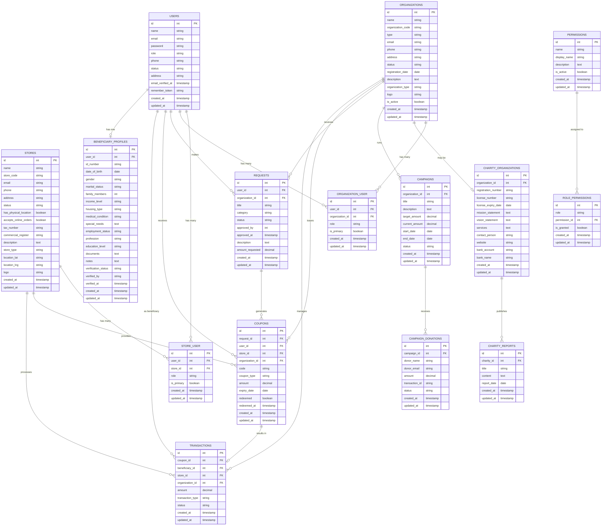

# مخطط قاعدة بيانات نظام كوبونات غزة (محسّن)

## نظرة عامة

تم تحسين هيكل قاعدة البيانات لنظام كوبونات غزة لتحقيق فصل أفضل بين الكيانات المختلفة وتقليل التكرار في البيانات. هذا المخطط يوضح الجداول الرئيسية والعلاقات بينها بعد التحسينات الإضافية.

## مخطط العلاقات (Entity-Relationship Diagram)

## تفاصيل التحسينات المنفذة لتقليل التكرار في البيانات

### 1. تحسين جدول المتاجر (`stores`)
- إضافة حقل `store_code` كمعرف فريد للمتجر
- إضافة حقول خاصة بالمتجر كمؤسسة:
  - `has_physical_location`: هل المتجر له موقع فعلي
  - `accepts_online_orders`: هل يقبل طلبات أونلاين
  - `tax_number`: الرقم الضريبي للمتجر
  - `commercial_register`: رقم السجل التجاري
- اعتماد علاقة المتجر بالمستخدمين عبر جدول `store_user` حيث يمكن استرجاع بيانات الاتصال من المستخدم الرئيسي

### 2. تحسين العلاقة بين الكوبونات والمعاملات
- ضمان أن لكل معاملة كوبون واحد فقط
- ربط المعاملات بالكوبونات المناسبة
- تحديث حالة الكوبونات المستخدمة

### 3. تحسين جدول المنظمات (`organizations`)
- إضافة حقل `organization_code` كمعرف فريد للمنظمة
- الاعتماد على العلاقات لتقليل تكرار البيانات مع جدول المستخدمين

### 4. تحسين جدول الطلبات (`requests`)
- إضافة حقل `organization_id` لتحديد الجهة المرسل إليها الطلب
- إضافة حقل `category` لتصنيف الطلبات
- إضافة حقل `amount_requested` لتحديد المبلغ المطلوب

### 5. تحسين جدول الكوبونات (`coupons`)
- إضافة حقل `organization_id` للمنظمة المصدرة للكوبون
- إضافة حقل `coupon_type` لتحديد نوع الكوبون (قياسي، خاص، هدية)

### 6. تحسين جدول المعاملات (`transactions`)
- إضافة حقل `transaction_type` لتصنيف المعاملة
- إضافة حقل `organization_id` للمنظمة المرتبطة بالمعاملة

## الفوائد الرئيسية للتحسينات الجديدة

1. **تقليل تكرار البيانات**: فصل واضح بين بيانات المستخدمين وبيانات المؤسسات (متاجر ومنظمات)
2. **علاقات أكثر دقة**: توضيح العلاقات بين الكيانات المختلفة (مثل المنظمات والطلبات والكوبونات)
3. **تحسين استخدام البيانات**: إضافة حقول تصنيفية للطلبات والمعاملات والكوبونات
4. **زيادة المرونة**: دعم أنواع مختلفة من المعاملات والكوبونات
5. **تعزيز سلامة البيانات**: ضمان اتساق العلاقات بين الجداول المختلفة

هذه التحسينات تساهم في جعل قاعدة البيانات أكثر كفاءة وأقل تكرارًا، مما يسهّل عمليات البحث والتحليل والتقارير ويحسن أداء النظام بشكل عام. 